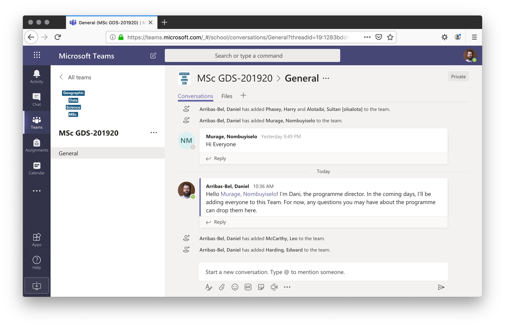

#
## Geographic Data Science

Introduction

[Dani Arribas-Bel](http://darribas.org)

#
## This course

## (Self-)Quiz

* Have you ever used **data** to make decisions in your life?
* Have you ever heard the term **"Data Science"**?
* Have you ever written a line of **computer code**?

## Philosophy

- (Lots of) **methods** and techniques
    - General overview
    - Intuition
    - Very little math
    - Lots of ways to continue on your own
- Emphasis on the **application** and **use**
- Close connection to **"real world"** applications

## Format

Eight blocks with:

- *Concepts*: videos + slides, readings
- *Hands-on*: concepts in (interactive) action
- *Do-It-Yourself*: practical material to do on your own

## Content

<ul>
<li class='fragment'> **Blocks A-C**: "big picture" content + computational tools (learning curve) </li>
<li class='fragment'> **Blocks D-H**: "meat" of the course (lots of concepts packed) </li>
<li class='fragment'> *Rest of the course*: prepare an awesome Computational Esssay </li>
</ul>

## Logistics - Website

[https://darribas.org/gds_course](https://darribas.org/gds_course)

<iframe src="https://darribas.org/gds_course" width=600 height=400 ></iframe>

## Logistics - Teams 

## Code

<iframe width="853" height="480" src="https://www.youtube.com/embed/M_rfujuRHUU" frameborder="0" allowfullscreen></iframe>

**Driving** Vs **automobile engineering**

## Python

## Python

<ul>
* **General purpose** programming language
* Sweet spot between *"proof-of-concept"* and *"production-ready"*
* Industry standard: **GIS** (Esri, QGIS) and **Data Science** (Google, Facebook, Amazon, Netflix, The New York Times, NASA...)
</ul>

## Self-directed learning 

**Prepare** 

<ul>
<li class='fragment'> This is a **flipped class**: it's like a gym, the "subscription" does not make you fit </li>
<li class='fragment'> **Bring** questions, comments, feedback, (informed) rants to Teams/labs </li>
<li class='fragment'> **Teams**, **Teams**, **Teams** </li>
<li class='fragment'> **Collaborate** (it's **NOT** a zero-sum win!!!) </li>
</ul>

## More help!!!

This course is much more about **"learning to learn"** and **problem 
solving** rather than acquiring specific programming tricks or stats wizardry

<ul>
<li class='fragment'> Learn to **ask** questions  (but don't expect
    exact answers all the time!!!) </li>
<li class='fragment'> **Help** others as much as you can (the best way to learn is to teach) </li>
<li class='fragment'> **Search** heavily on Google + Stack Overflow </li>
</ul>

## Workflow - Before a Lab

1. Go over the *Concepts* and *Hands-on* sections of a block
1. Get started on the *DIY*
1. Record questions and **post** them on Teams **prior to the lab**

## Workflow - Online Labs

1. Come work on the ***DIY*** sections
1. Live **answers** to questions posted
1. **Support** from demonstrators and module lead

#
## Assignments
## Assignments

- Computer tests: W.5 (25%) and W.10 (25%)
- Computational essay (W.12, 50%)
     - Equivalent to 2,500 word
     - Report (*notebook*) with **code**, **figures** (e.g. maps), and **text**
- Discussion board (5%)

**NOTE**: recommendation letters only for great students (**>70**)

#
  A Course on Geographic Data Science by <a xmlns:cc="http://creativecommons.org/ns#" href="http://darribas.org" property="cc:attributionName" rel="cc:attributionURL">Dani Arribas-Bel</a> is licensed under a <a rel="license" href="http://creativecommons.org/licenses/by-sa/4.0/">Creative Commons Attribution-ShareAlike 4.0 International License</a>.

